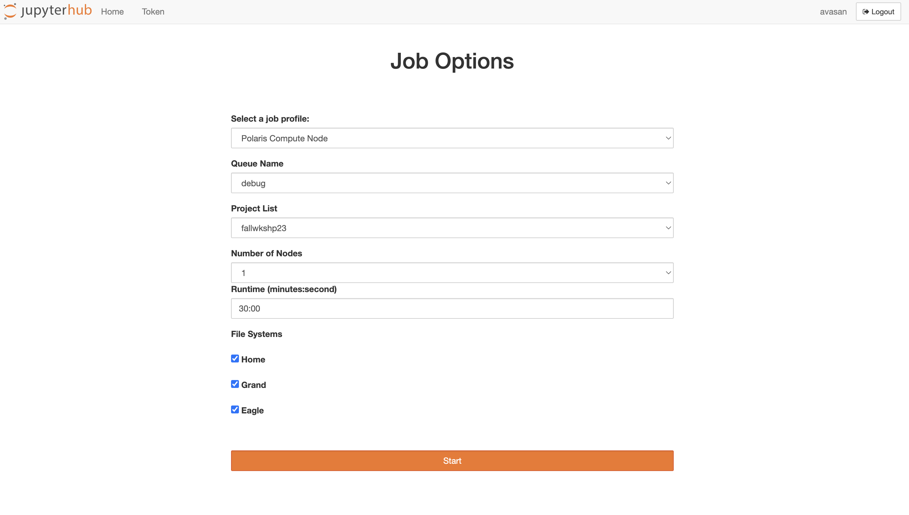

# Using Jupyter Notebooks on Polaris

## Logging in 

Login via: https://jupyter.alcf.anl.gov/

Select "Login Polaris" and use your ALCF credentials and Multi-Factor Authentication.

<video id="myBGvid" autoplay muted loop>
<source src="[https://github.com/architvasan/alcf_tutorial/blob/b927498f73435a795f17b65716bcf41b305f94a5/JupyterNotebookLogin.gif](https://github.com/architvasan/alcf_tutorial/blob/b927498f73435a795f17b65716bcf41b305f94a5/JupyterNotebookLogin.gif)">
</video>

## Server settings and start up
You want to setup your server options to these following:
* Job profile: Polaris Compute Node
* Queue Name: debug
* Project List: fallws23single
* Number of Nodes: 1-2
* Runtime: please spec

When you click "Start" you are submitting a job to the batch queue and waiting for the job to begin.

## Creating a new notebook

Once the job begins, start a new notebook as follows:

**Put instruction image here.png**

## Running python programs within your notebook

Once you create your notebook, please feel free to rename it as follows:

**Renaming image.png**

Then, to use a conda environment with most of the necessary python modules (e.g. numpy, matplotlib, pandas, pytorch), please change your kernel for the notebook to datascience/conda-2023-01-10.

**Changing kernel example.gif**

Now, we will show you a simple python script where we create a list of numbers and plot this using matplotlib.

**Add simple python script example here.**
