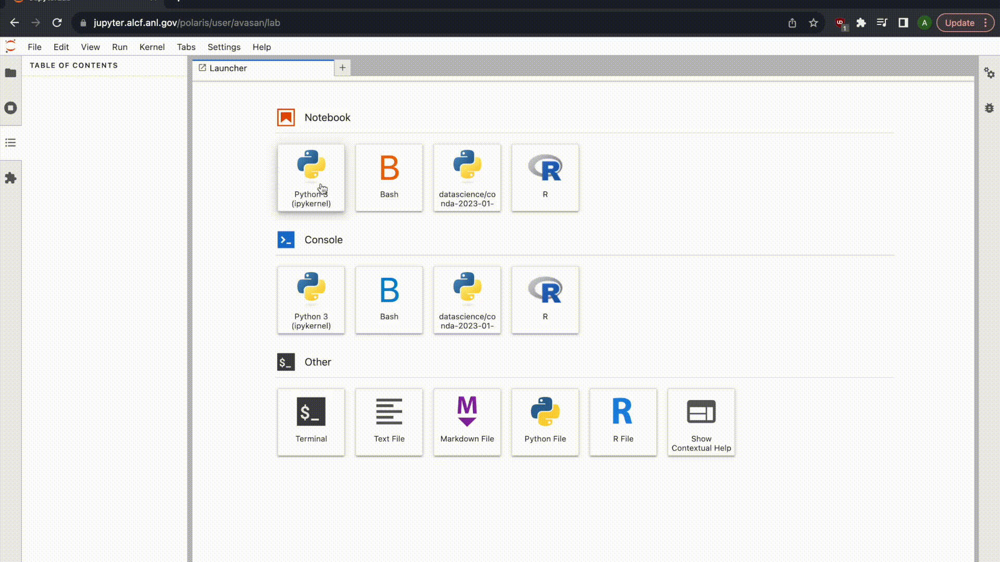

# Using Jupyter Notebooks on Polaris

## Logging in 

Login via: https://jupyter.alcf.anl.gov/

Select "Login Polaris" and use your ALCF credentials and Multi-Factor Authentication.

<video id="myBGvid" autoplay muted loop>
<source src="[https://github.com/architvasan/alcf_tutorial/blob/b927498f73435a795f17b65716bcf41b305f94a5/JupyterNotebookLogin.gif](https://github.com/architvasan/alcf_tutorial/blob/b927498f73435a795f17b65716bcf41b305f94a5/JupyterNotebookLogin.gif)">
</video>

## Server settings and start up
You want to setup your server options to these following:
* Job profile: Polaris Compute Node
* Queue Name: debug
* Project List: fallws23single
* Number of Nodes: 1-2
* Runtime: please spec

When you click "Start" you are submitting a job to the batch queue and waiting for the job to begin.

## Creating a new notebook and running python programs

Once the job begins, start a new notebook and feel free to rename it.

To use a conda environment with most of the necessary python modules (e.g. numpy, matplotlib, pandas, pytorch), please change your kernel for the notebook to datascience/conda-2023-01-10.

In this video, we are showing the steps of setting up a notebook, loading the appropriate environment and running a simple python script.

## Running Machine learning modules

Finally, we show how to load machine learning modules Tensorflow and Pytorch. These are installed natively in the datascience/conda-2023-01-10 module. We also show how to check GPU usage for each module.

~[MLRun GIF](JupyterNotebook_ML.gif)
